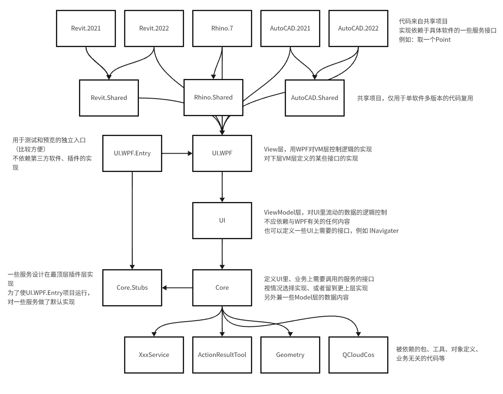

## 使用方式
Clone仓库到本地
使用最新的Visual Studio打开项目

- 情况1：单独运行WPF项目->运行Sample.UI.WPF.Entry
- 情况2：在某个软件（AutoCAD、Rhino、Revit）中运行->进入对应文件夹，阅读对应的README.md文件

## 项目关系图

## 文件夹和详细说明
[AutoCAD](AutoCAD/README.md)
[Rhino](Rhino/README.md)
[Revit](Revit/README.md)
[UI](UI/README.md)
[Core](Core/README.md)
[DevTool](DevTool/README.md)
[Test](Test/README.md)